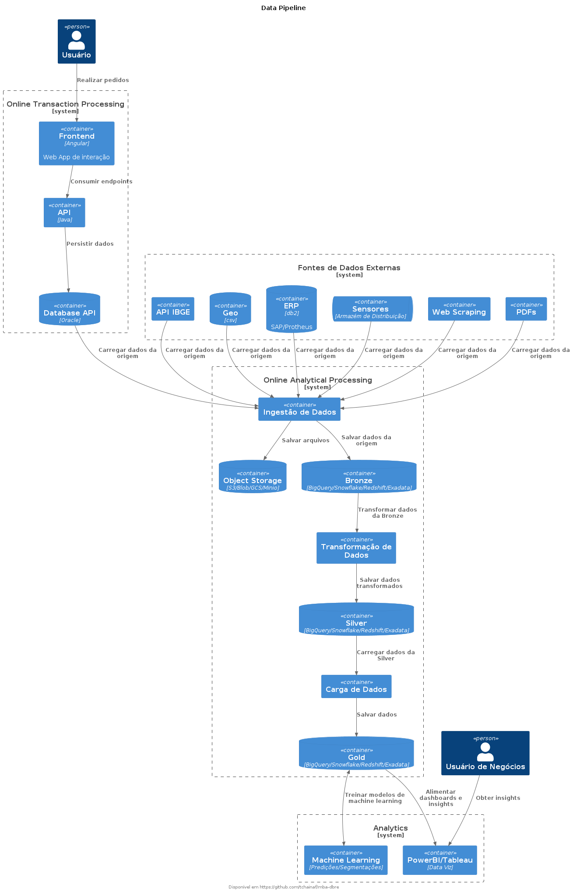

# MBA - DBRE

Repositório com atividades do curso MBA em DevOps e Cloud Computing da Universidade Mackenzie, realizadas na matéria de Database Reliability Engineer e DataOps.

As atividades foram realizadas com base no passo a passo do [repositório](https://github.com/acnaweb/mackenzie-2025-1) do professor.

## Diagramas

### Data Pipeline

## Referências

- [PlantUML](https://github.com/plantuml-stdlib/C4-PlantUML)
- [Release Please](https://github.com/googleapis/release-please)
- [java-ping](https://github.com/tchainaf/java-ping)

- [minio](https://github.com/acnaweb/minio)
- [database](https://github.com/acnaweb/database)
- [dbt](https://github.com/acnaweb/dbt)